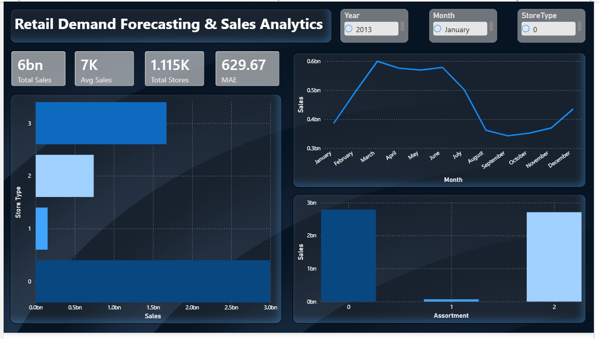
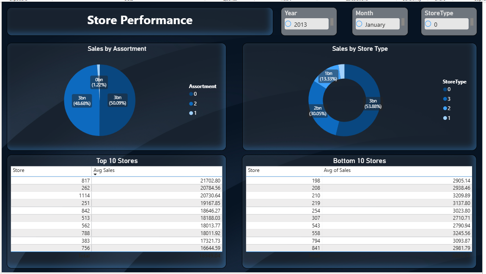
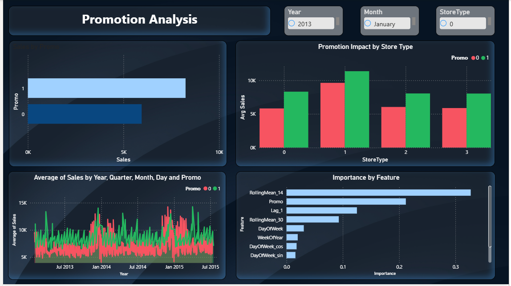
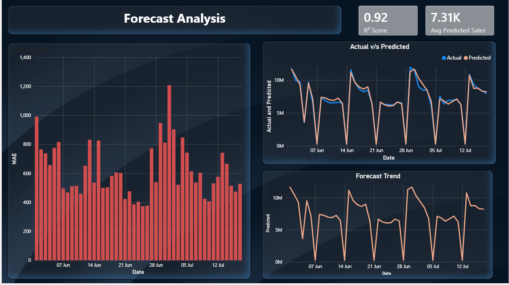

# Retail Sales Forecasting & Business Performance Analysis

> An end-to-end Retail Sales Forecasting and Business Analytics project built using Python, Machine Learning, SHAP Explainability, and Power BI to help optimize inventory planning, promotional strategies, and business decision-making.

---

## Project Overview

Retail businesses often struggle to accurately forecast future sales, leading to inventory shortages, excess stock, and inefficient promotional planning.

This project analyzes historical sales data from Rossmann stores and develops an end-to-end forecasting system that predicts future daily sales while providing actionable business insights through interactive dashboards and explainable AI.

The solution combines data analytics, feature engineering, machine learning, model explainability, and business intelligence to simulate a real-world retail forecasting system.

---

## Project Highlights

- End-to-end Retail Sales Forecasting System
- Machine Learning-based demand prediction using XGBoost
- FastAPI REST API for real-time predictions
- Interactive frontend dashboard built with HTML, CSS, and JavaScript
- Automated PDF business report generation
- Historical sales visualization with Chart.js
- Business recommendation engine
- Explainable AI using SHAP
- Power BI dashboard for executive analytics
- Deployed on AWS EC2

---

## Business Objectives

- Forecast future daily sales for each store
- Identify key drivers influencing sales
- Evaluate the effectiveness of promotional campaigns
- Analyze seasonal sales patterns
- Support inventory planning and resource allocation
- Deliver business insights through interactive Power BI dashboards

---

## Dataset

**Source:** Rossmann Store Sales Dataset (Kaggle)

The project uses the following datasets:

- **train.csv** – Historical daily sales transactions
- **store.csv** – Store metadata
- **test.csv** – Future dates for prediction
- **sample_submission.csv** – Kaggle reference file

---

# Project Workflow

```
Business Understanding
        ↓
Data Understanding
        ↓
Data Cleaning
        ↓
Exploratory Data Analysis
        ↓
Feature Engineering
        ↓
Model Building
        ↓
Hyperparameter Tuning
        ↓
Model Explainability (SHAP)
        ↓
Business Recommendations
        ↓
Power BI Dashboard
```

---

# Tech Stack

## Programming Languages

- Python
- JavaScript
- HTML5
- CSS3

## Backend

- FastAPI
- Uvicorn

## Machine Learning

- Scikit-learn
- XGBoost
- SHAP

## Data Processing

- Pandas
- NumPy

## Visualization

- Matplotlib
- Seaborn
- Chart.js
- Power BI

## Report Generation

- ReportLab

## Deployment

- AWS EC2
- Ubuntu Linux
- Git
- GitHub

## Development Tools

- VS Code
- Jupyter Notebook

---

# System Architecture
```
                Rossmann Dataset
                       │
                       ▼
             Data Cleaning & EDA
                       │
                       ▼
            Feature Engineering
                       │
                       ▼
              XGBoost Model
                       │
                 model.pkl
                       │
                       ▼
                FastAPI Backend
      ┌───────────────┼────────────────┐
      ▼               ▼                ▼
 Prediction API   History API     Report API
      │               │                │
      └───────────────┼────────────────┘
                      ▼
         HTML/CSS/JavaScript Dashboard
                      │
                      ▼ 
                Interactive Charts
                      │
                      ▼ 
                  Business Insights

```

# Project Structure

```
Retail-Demand-Forecasting
│
├── backend/
│   ├── routes/
│   ├── services/
│   ├── models/
│   ├── schemas/
│   ├── utils/
│   ├── main.py
│   └── data_loader.py
│
├── frontend/
│   ├── css/
│   ├── js/
│   ├── images/
│   ├── index.html
│   └── dashboard.html
│
├── dashboard/
│
├── notebooks/
│
├── reports/
│
├── assets/
│
├── data/
│
├── requirements.txt
│
└── README.md
```

---

# Data Analysis

Performed extensive exploratory analysis to understand business performance.

### Key Analysis

- Daily and monthly sales trends
- Top and bottom performing stores
- Promotion effectiveness
- Store type comparison
- Assortment analysis
- Holiday impact
- Competition analysis
- Correlation analysis
- Seasonal patterns

---

# Feature Engineering

Created advanced forecasting features including:

### Calendar Features

- Year
- Month
- Quarter
- Week
- Day
- Day of Year
- Month Start
- Month End
- Weekend Indicator

### Time-Series Features

- Lag 1
- Lag 7
- Lag 14
- Lag 30

### Rolling Statistics

- 7-Day Rolling Mean
- 14-Day Rolling Mean
- 30-Day Rolling Mean
- Rolling Standard Deviation

### Business Features

- Competition Age
- Promotion Duration

### Cyclical Encoding

- Month (Sin/Cos)
- Day of Week (Sin/Cos)

---

# Machine Learning Models

The following regression models were trained and compared:

- Linear Regression
- Decision Tree Regressor
- Random Forest Regressor
- XGBoost Regressor

Hyperparameter tuning was performed using **RandomizedSearchCV** to optimize the final XGBoost model.

---

# Model Performance

| Model | MAE | RMSE | R² |
|------|------:|------:|------:|
| Linear Regression | 858.50 | 1214.24 | 0.8511 |
| Decision Tree | 775.23 | 1112.03 | 0.8751 |
| Random Forest | 712.19 | 1017.9 | 0.8954 |
| **XGBoost** | **629.67** | **882.91** | **0.9213** |

**Final Selected Model:** XGBoost Regressor

---

# Explainable AI

To improve model transparency, SHAP (SHapley Additive Explanations) was used.

Generated explainability visualizations include:

- SHAP Summary Plot
- SHAP Feature Importance
- SHAP Waterfall Plot

These explain how different features influence sales predictions both globally and for individual predictions.

---

# Power BI Dashboard

Developed an interactive executive dashboard consisting of four pages:

### Executive Overview

- Total Sales
- Average Sales
- Total Stores
- Monthly Sales Trend

### Store Performance

- Top 10 Stores
- Bottom 10 Stores
- Revenue by Store Type
- Revenue by Assortment

### Promotion Analysis

- Promotion vs Non-Promotion Sales
- Promotion Impact by Store Type
- Promotion Timeline
- SHAP Feature Importance

### Forecast Dashboard

- Actual vs Predicted Sales
- Prediction Error
- Forecast Trend
- Inventory Recommendation
- Forecast Accuracy

---

# Business Insights

- Promotional campaigns were associated with higher daily sales across most stores.
- Sales exhibited strong weekly and seasonal patterns.
- Historical sales (lag features) were the strongest predictors of future sales.
- Store type and assortment significantly influenced revenue.
- Competition distance showed comparatively lower impact on sales.
- Forecasting can support proactive inventory planning and workforce allocation.

---

# Business Recommendations

- Increase inventory before forecasted high-demand periods.
- Prioritize promotions for stores with historically strong promotional response.
- Optimize staffing using predicted sales trends.
- Monitor underperforming stores for operational improvements.
- Use forecasting to improve replenishment planning and reduce stockouts.

---

# REST API

The project exposes REST APIs using FastAPI.

| Method | Endpoint | Description |
|---------|----------|-------------|
| POST | /predict | Predict future sales |
| GET | /history/{store} | Historical sales |
| GET | /forecast/{store} | Actual vs Predicted Sales |
| GET | /store-types | Store Type Analysis |
| GET | /promotion-impact | Promotion Analysis |
| GET | /report | Download PDF Report |

Swagger Documentation

http://localhost:8000/docs

---

# Frontend Dashboard

A responsive dashboard was developed using HTML, CSS, and JavaScript.

Features include:

- Sales Forecast Card
- Demand Level
- Inventory Recommendation
- Business Recommendations
- Historical Sales Trend
- Store Performance Chart
- Actual vs Predicted Sales
- Promotion Impact Analysis
- Download PDF Report

# Deployment

The complete application was deployed on AWS EC2.

Deployment Steps

1. Launch Ubuntu EC2 Instance
2. Configure Security Groups
3. Clone GitHub Repository
4. Create Python Virtual Environment
5. Install Dependencies
6. Start FastAPI using Uvicorn
7. Host Frontend using Nginx
8. Access application through Public IP

Technology Used

- AWS EC2
- Ubuntu Linux
- Uvicorn
- Nginx

# Challenges Faced

During development and deployment, the following issues were encountered and resolved:

- Missing values in date columns caused runtime errors (`year 0 is out of range`).
- XGBoost compatibility issues with Python 3.14.
- EC2 disk quota exceeded while installing dependencies.
- API error handling for invalid requests.
- Model serialization compatibility across XGBoost versions.

# Future Improvements

- Dockerize the application
- CI/CD using GitHub Actions
- User authentication
- Store prediction history in a database
- Deploy behind Nginx with HTTPS
- Daily automated model retraining
- Weather and economic indicators
- Deep Learning forecasting (LSTM, TFT)
- Cloud storage for reports

---

# Dashboard Preview


----

----

---

---

# Repository

```
data/
dashboard/
images/
models/
notebooks/
reports/
README.md
requirements.txt
```

---

# Author

**P S**

Aspiring Data Scientist | Data Analyst

